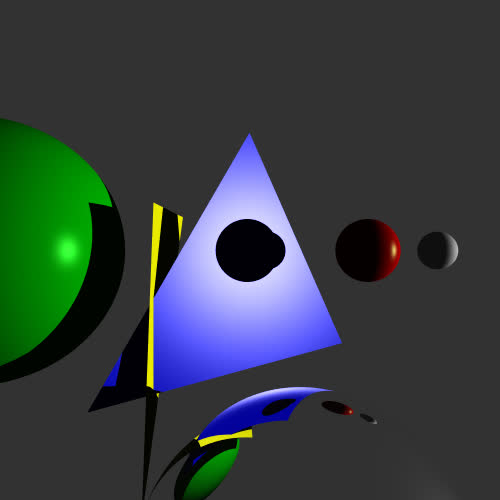
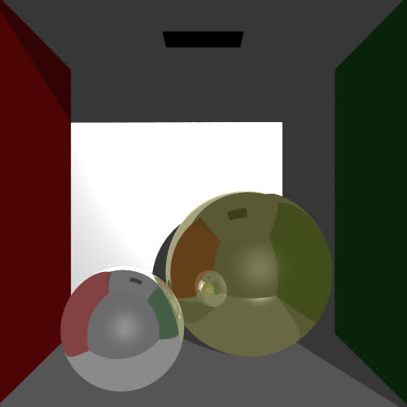
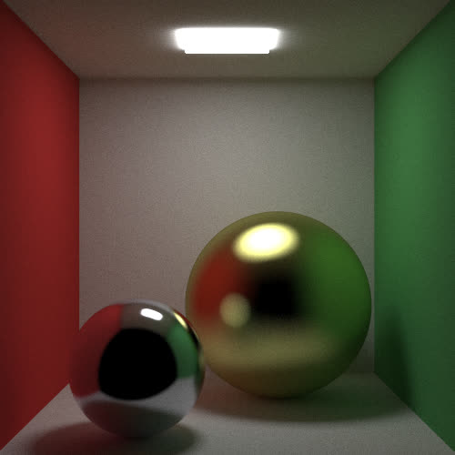

# CS 455 Raytracer

Raytracer for CS 455. Includes unit tests and sampling. Has a phong shading algorithm and a more realistic rendering algorithm.

## Images produced by this raytracer

### Recursive raytracing algorithm

### Brute-force path tracing algorithm

